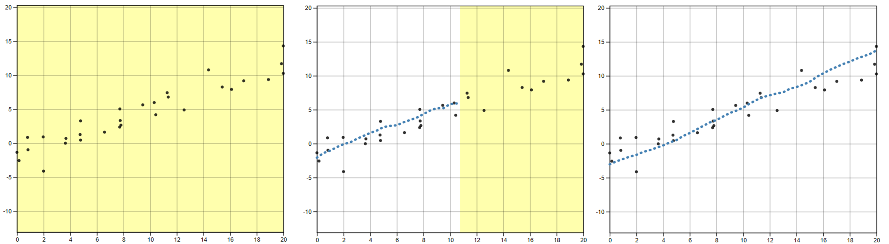

```{r setup, include = F}
knitr::opts_chunk$set(
  echo = F, eval = T, messages = F, warnings = F,
  fig.width = 6, fig.height = 4,  fig.align = 'center',
  out.width = "\\linewidth", dpi = 300, 
  tidy = T, tidy.opts=list(width.cutoff=45),
  fig.pos = "tbp",
  out.extra = ""
)
```

```{r load-packages, include = F}
library(readr)
library(tidyverse)
library(knitr)
library(gridExtra)
library(patchwork)
library(cowplot)
library(ggforce)
library(here)
```

# Introduction
We all use statistical graphics, but how do we know that the graphics we use are communicating properly? When creating a graphic, we must consider the design choices most effective for conveying the intended result. For instance, we may decide to highlight the relationship between two variables in a scatterplot by including a trend line, or adding color to highlight clustering [@vanderplas2017clusters].
These design choices require that we understand the perceptual and visual biases that come into play when creating graphics, and as graphics are evaluated visually, we must use human testing to ground our understanding in empiricism.

Much of the research on the perception of visual features in charts has been conducted in psychophysics and tests for accuracy and quantitative comparisons when understanding a plot. 
@cleveland1984graphical conducted a series of cognitive tasks designed to establish a hierarchy of visual components for making comparisons. 
For example, it is more effective to display information on an $x$ or $y$ axis rather than using color in order to reduce the visual effort necessary to make numerical comparisons.
@cleveland1985graphical found that assessing the position of points along an axis is easier than determining the slope of a line. Other studies focused on the viewers' ability to perceive the strength of the relationship between $x$ and $y$ coordinates in a scatterplot. For instance, when the data appear dense, viewers tend to overestimate the magnitude of the correlation coefficient [@cleveland1982variables; @lauer1989density]. @cleveland1993visualizing provided an argument for displaying cyclical patterns with an aspect ratio which sets the curve close to 45$^{\circ}$. @kosslyn2006graph examined how Gestalt principles of perceptual organization are instrumental in extracting data from a chart. For example, data points that are closer in space are more likely to be perceived as grouped [@ciccione2020grouping], and vertical and horizontal lines are easier to discriminate than oblique ones [@appelle1972perception].
The results of these cognitive tasks provided some consistent guidance for chart design; however, other methods of visual testing can further evaluate design choices and help us understand cognitive biases related to the evaluation of statistical charts.

## Testing Statistical Graphics

We need human testing of graphics in order to draw broad conclusions, develop guidelines for graphical design, and improve graphical communication.
Studies might ask participants to identify differences in graphs, read information off of a chart accurately, use data to make correct real-world decisions, or predict the next few observations.
All of these types of tests require different levels of use and manipulation of the information being presented in the chart. 
Early research studies considered graphs from a psychological perspective [@spence1990visual; @lewandowsky1989perception], testing participants' abilities to detect a stimulus or a difference between two stimuli. Psychophysical methods have been used to test graphical perception, as in @vanderplas2015signs, which used the method of adjustment to estimate the magnitude of the impact of the sine illusion. 
However, there are more modern testing methods that have been developed since the heyday of psychophysics.

One major development in statistical graphics which led to more advanced testing methods is Wilkinson’s Grammar of Graphics [@wilkinson2013grammar].
The Grammar of Graphics serves as the fundamental framework for data visualization with the notion that graphics are built from the ground up by specifying exactly how to create a particular graph from a given data set.
Visual representations are constructed through the use of “tidy data” which is characterized as a data set in which each variable is in its own column, each observation is in its own row, and each value is in its own cell [@wickham2016r].
Graphics are viewed as a mapping from variables in a data set (or statistics computed from the data) to visual attributes such as the axes, colors, shapes, or facets on the canvas in which the chart is displayed.
Software, such as Hadley Wickham’s ggplot2 [@wickham2011ggplot2], aims to implement the framework of creating charts and graphics as the Grammar of Graphics recommends.

Combining the Grammar of Graphics with another tool for statistical graphics testing, the statistical lineup, yields a method for evaluating graphical design choices.
@buja2009statistical introduced the lineup protocol to provide a framework for inferential testing.
Through experimentation, methods such as the lineup protocol allow researchers to conduct studies geared at understanding human ability to conduct tasks related to the perception of statistical charts such as differentiation, prediction, estimation, and extrapolation [@vanderplas2017clusters; @vanderplas2015spatial; @hofmann2012graphical].
The advancement of graphing software provides the tools necessary to develop new methods of testing statistical graphics.
While these testing methods are excellent, there is one particular subset of statistical graphics testing methods which we intend to develop further in this paper: assessing graphics by fitting statistical models "by eye".

## Fitting Trends by Eye

Initial studies in the 20th century explored the use of fitting lines by eye through a set of points [@unwin1988eyeballing; @finney1951subjective; @mosteller1981eye]. 
Common methods of fitting trends by eye involved maneuvering a string, black thread, or ruler until the fit is suitable, then drawing the line through the set of points. Recently, @ciccione2021can conducted a comprehensive set of studies investigating human ability to detect trends in graphical representations using physical adjustment and manipulation methods.

@finney1951subjective used graphical testing for computational purposes: to determine the effect of stopping iterative maximum likelihood calculations after one iteration. 
Many techniques in statistical analysis are performed with the aid of iterative calculations such as Newton's method or Fisher's scoring.
The author was interested in whether one iteration of calculations was sufficient in the estimation of parameters connected with pharmaceutical dose-response relationships. 
In pharmaceuticals, one measure of interest is the relative potency between a test preparation of doses and standard preparation of does; relative potency is calculated as the ratio of two equally effective doses between the two preparation methods. 
In this study, twenty-one scientists were recruited via postal mail and asked to "rule two lines" in order to judge by eye the positions for a pair of parallel probit regression lines in a biological assay.
The author then computed one iterative calculation of the relative potency based on starting values as determined by the pair of lines drawn by each participant. The author then compared these relative potency estimates to that which was estimated by the full probit technique (reaching convergence through multiple iterations).
Results of the study indicated that one cycle of iterations for calculating the relative potency was sufficient based on the starting values provided by eye from the participants.

@mosteller1981eye sought to understand the properties of least squares and other computed lines by establishing one systematic method of fitting lines by eye. 
Participants were asked to fit lines by eye to four scatterplots using an 8.5 x 11 inch transparency with a straight line etched completely across the middle. 
A latin square design with packets of the set of points stapled together in four different sequences was used to determine if there is an effect of order of presentation.
It was found that order of presentation had no effect and that participants tended to fit the slope of the principal axis (error minimized orthogonally, both horizontal and vertical, to the regression line) over the slope of the least squares regression line (error minimized vertically to the regression line).
These results support previous research on "ensemble perception" indicating the visual system can compute averages of various features in parallel across the items in a set [@chong2003representation; @chong2005statistical; @van2011rapid].

In @ciccione2021can, participants were asked to judge trends, estimate slopes, and conduct extrapolation.
To estimate slopes, participants were asked to report the slope of the best-fitting regression line using a track-pad to adjust the tilt of a line on the screen.
Results indicated the slopes participants reported were always in excess of the ideal slopes, both in the positive and in the negative direction, and those biases increase with noise and with number of points. 
This supports the results found in @mosteller1981eye and suggest that participants might use Deming regression [@deming1943statistical; @linnet1998performance; @martin2000general], which minimizes the Euclidean distance of points from the line, when fitting a line to a noisy scatterplot.

While not explicitly intended for perceptual testing, in 2015, the New York Times introduced an interactive feature, called 'You Draw It' [@aisch_cox_quealy_2015; @buchanan_park_pearce_2017; @katz_2017].
Readers were asked to input their own assumptions about various metrics and compare how these assumptions relate to reality.
The New York Times team utilizes Data Driven Documents (D3) [@bostock2011d3] that allows readers to predict these metrics through the use of drawing a line on their computer screen with their computer mouse. 
After the reader has completed drawing the line, the actual observed values are revealed and the reader may check their estimated knowledge against the actual reported data.
While this interactive feature is designed to get readers to confront their own intuitions about data in the news, we feel that the interactivity of this method may be useful for the purpose of graphical testing and measuring the patterns humans see in data.

In this paper, we establish 'You Draw It', adapted from the New York Times feature, as a tool for graphical testing. Our visual system is naturally built to look for structure and identify patterns. For instance, points going down from left to right indicates a negative correlation between the $x$ and $y$ variables. Our research is intended to implement the 'You Draw It' feature as a way to measure the patterns we see in data.
We validate the 'You Draw It' method by replicating the less technological study conducted by @mosteller1981eye.
Based on previous research surrounding "ensemble perception," we hypothesize that visual regression tends to mimic principle component regression rather than an ordinary least squares regression.
In order to assess this hypothesis, we introduce a method for statistically modeling the participant drawn lines using generalized additive mixed models.

# Methods

## Participants

Participants were recruited through through Twitter, Reddit, and direct email in May 2021.
A total of 35 individuals completed 119 unique 'You Draw It' task plots; data collected from all completed 'You Draw It' task plots were included in the analysis.
All participants had normal or corrected to normal vision and signed an informed consent form.
The experimental tasks took approximately 15 minutes to complete.
While this study does utilize a convenience sample, as this is primarily a perceptual task, previous results have found few differences between expert and non-expert participants in this context [@vanderplas2015spatial].
These data were collected to validate this method of graphical testing, with the hopes of providing a new tool to assess graphical perception interactively.
Participants completed the experiment on their own computers in an environment of their choosing. The experiment was conducted and distributed through a Shiny application [@shinyPkg] found at [emily-robinson.shinyapps.io/you-draw-it-validation-applet](https://emily-robinson.shinyapps.io/you-draw-it-validation-applet/).

## 'You Draw It' Task

In the study, participants were shown an interactive scatterplot \pcref{fig:ydi-stimuli} along with the prompt, “Use your mouse to fill in the trend in the yellow box region.”
The yellow box region moved along as the user drew their trend-line, providing a visual cue which indicates where the user still needed to complete a trend line. After the entire domain had been visually estimated or predicted, the yellow shaded region disappeared, indicating the participant had completed the task.
Data Driven Documents (D3), a JavaScript-based graphing framework that facilitates user interaction, was used to create the 'You Draw It' visual. 
In order to allow for user interaction and data collection, we integrated the D3 visual into Shiny using the `r2d3` package [@r2d3].
While the interface is highly customized to this particular task, we hope to generalize the code and provide a Shiny widget in an R package soon.

```{r ydi-stimuli, include = T, fig.cap = "'You Draw It' task plot as shown to particpants during the study. The first frame (left) illustrates what particpants first saw with the prompt “Use your mouse to fill in the trend in the yellow box region.” The second frame (middle), illustrates what the particpant saw while completing the task; the yellow shaded region provided a visual cue for participants indicating where the participant still needed to complete a trend-line. The last frame (right) illustrates the participants finished trend-line before submission.", out.width="100%"}

```

## Data Generation

All data processing was conducted in R software environment for statistical computing and graphics [@Rsoftware]. 
A total of $N = 30$ points $(x_i, y_i), i = 1,...,N$ were generated for $x_i \in [x_{min}, x_{max}]$ where $x$ and $y$ have a linear relationship.
Data were simulated based on a linear model with additive errors: 
\begin{align}
y_i & = \beta_0 + \beta_1 x_i + e_i \\
\text{with } e_i & \sim N(0, \sigma^2). \nonumber
\end{align} 

Model equation parameters, $\beta_0$ and $\beta_1$, were selected to reflect the four data sets (F, N, S, and V) used in @mosteller1981eye \pcref{tab:eyefitting-parameters}. We computed $\beta_0$ from the point-slope equation of a line using the mean of the generated $x$ values and the predefined $y$ value at $\bar x$, denoted $y_{\bar x}$.
Parameter choices F, N, and S simulated data across a domain of 0 to 20. 
Parameter choice F produced a trend with a positive slope and a large variance while N had a negative slope and a large variance. 
In comparison, S showed a trend with a positive slope and a small variance while V yielded a steep positive slope with a small variance over the domain of 4 to 16. 
\cref{fig:eyefitting-simplot} illustrates an example of simulated data for all four parameter choices intended to reflect the trends in @mosteller1981eye.
Aesthetic design choices were made consistent across each of the interactive 'You Draw It' task plots. 
The y-axis range extended 10\% beyond (above and below) the range of the simulated data points to allow for users to draw outside the simulated data set range and avoid anchoring their lines to the corners of the plot. 

```{r eyefitting-parameters}
          data.frame(Parm = c("F", "N", "S", "V"),
                     y_xbar = c(3.9, 4.11, 3.88, 3.89),
                     slope = c(0.66, -0.70, 0.66, 1.98),
                     sigma = c(1.98, 2.5, 1.3, 1.5)
          ) %>%
            mutate(Parm = factor(Parm, levels = c("S", "F", "V", "N"))) %>%
            arrange(Parm) %>%
            knitr::kable("latex", 
                         digits = 2, 
                         escape = F, 
                         booktabs = T, 
                         linesep = "", 
                         align = "c", 
                         label = "eyefitting-parameters",
                         col.names = c("Parameter Choice", "$y_{\\bar{x}}$", "$\\beta_1$", "$\\sigma$"),
                         caption = "Designated model equation parameters for simulated data.")
```

```{r eyefitting-simplot, fig.height = 3, fig.width = 9, fig.cap = "Example of simulated data points displayed in a scatterplot illustrating the trends associated with the four selected parameter choices.", out.width="100%"}
          
eyefitting_example_sim <- read.csv(here("results/youdrawit-eyefitting-simdata-example.csv"))

eyefitting_example_simplot <- eyefitting_example_sim %>%
  filter(data == "point_data") %>%
  filter(dataset %in% c("F", "N", "S") | (x < 16 & x > 4)) %>%
  mutate(dataset = factor(dataset, levels = c("S", "F", "V", "N"))) %>%
  dplyr::rename(`Parameter Choice` = dataset) %>%
  ggplot(aes(x = x, y = y)) +
  geom_point(size = 1) +
  facet_wrap(~`Parameter Choice`, ncol = 4) +
  theme_bw(base_size = 14) +
  theme(aspect.ratio = 1,
  legend.position = "none",
  plot.title   = element_text(size = 12, hjust = 0),
  axis.text    = element_text(size = 12),
  axis.title   = element_text(size = 12),
  legend.title = element_text(size = 12),
  legend.text  = element_text(size = 12),
  # strip.text = element_text(size = 5, margin = margin(0.05,0,0.05,0, "cm")),
  # strip.background = element_rect(size = 0.5),
  legend.key.size = unit(1, "line")
) +
  scale_y_continuous(breaks = seq(-10, 20, 5))
eyefitting_example_simplot
```

## Study Design

This experiment was conducted as part of a larger study of the perception of log and linear scales; for simplicity, we focused on the study design and methods related to the current study. Each scatterplot was the graphical representation of a data set that was generated randomly and independently for each participant at the start of the experiment.
Participants in the study were shown two 'You Draw It' practice plots in order to train participants in the skills associated with executing the task - in particular, the responsiveness of the applet requires that participants draw a line at a certain speed, ensuring that all of the evenly spaced points along the hand-drawn line are filled in. 
During the practice session, participants were provided with instruction prompts accompanied by a .gif and a practice plot.
Instructions guided participants to start at the edge of the yellow box, to make sure the yellow shaded region was moving along with their mouse as they drew, and that they could draw over their already drawn line.
Practice plots were then followed by four 'You Draw It' task plots associated with the current study.
The order of the task plots was randomly assigned for each individual in a completely randomized design.

# Results

## Fitted Regression Lines

We compared the participant drawn line to two regression lines determined by ordinary least squares (OLS) regression and regression based on the principal axis (PCA). \cref{fig:ols-vs-pca-example} illustrates the difference between an OLS regression line which minimizes the vertical distance of points from the line and a regression line based on the principal axis which minimizes the Euclidean distance of points (orthogonal) from the line. 

Due to the randomness in the data generation process, the actual slope of the linear regression line fit through the simulated points could differ from the predetermined slope.
Therefore, we fit an OLS regression to each scatterplot to obtain estimated parameters $\hat\beta_{0,OLS}$ and $\hat\beta_{1,OLS}$. 
Fitted values, $\hat y_{k,OLS}$, were then obtained every 0.25 increments across the domain from the OLS regression equation, $\hat y_{k,OLS} = \hat\beta_{0,OLS} + \hat\beta_{1,OLS} x_k$., for $k = 1, ..., 4 x_{max} +1$. 
The regression equation based on the principal axis was determined by using the `princomp` function in the stats package in base R to obtain the rotation of the coordinate axes from the first principal component (direction which captures the most variance).
The estimated slope, $\hat\beta_{1,PCA}$, was determined by the ratio of the axis rotation in $y$ and axis rotation in $x$ of the first principal component with the y-intercept, $\hat\beta_{0,PCA}$ calculated by the point-slope equation of a line using the mean of the simulated points, $(\bar x_i, \bar y_i)$.
Fitted values, $\hat y_{k,PCA}$, were then obtained every 0.25 increment across the domain from the PCA regression equation, $\hat y_{k,PCA} = \hat\beta_{0,PCA} + \hat\beta_{1,PCA} x_k$.

```{r ols-vs-pca-example, fig.height = 3, fig.width = 6, fig.cap=" Comparison between an OLS regression line which minimizes the vertical distance of points from the line and a regression line based on the principal axis which minimizes the Euclidean distance of points (orthogonal) from the line.", message=FALSE, warning=FALSE, out.width="80%"}
library(ggplot2)
library(magrittr)
library(plyr)

set.seed(2)
corrCoef = 0.5 # sample from a multivariate normal, 10 datapoints
dat = MASS::mvrnorm(10,c(0,0),Sigma = matrix(c(1,corrCoef,2,corrCoef),2,2))
dat[,1] = dat[,1] - mean(dat[,1]) # it makes life easier for the princomp
dat[,2] = dat[,2] - mean(dat[,2])

dat = data.frame(x1 = dat[,1],x2 = dat[,2])

# Calculate the first principle component
# see http://stats.stackexchange.com/questions/13152/how-to-perform-orthogonal-regression-total-least-squares-via-pca
v = dat%>%prcomp%$%rotation
x1x2cor = bCor = v[2,1]/v[1,1]

x1tox2 = coef(lm(x1~x2,dat))
x2tox1 = coef(lm(x2~x1,dat))
slopeData = data.frame(slope = c(x1x2cor,x2tox1[2]),
                       type=c("PC", "OLS"))

# We want this to draw the neat orthogonal lines.
pointOnLine = function(inp){
  # y = a*x + c (c=0)
  # yOrth = -(1/a)*x + d
  # yOrth = b*x + d
  x0 = inp[1] 
  y0 = inp[2] 
  a = x1x2cor
  b = -(1/a)
  c = 0
  d = y0 - b*x0
  x = (d-c)/(a-b)
  y = -(1/a)*x+d
  return(c(x,y))
}

points = apply(dat,1,FUN=pointOnLine)

segmeData = rbind(data.frame(x=dat[,1],y=dat[,2],xend=points[1,],yend=points[2,],type = "PC"),
                  data.frame(x=dat[,1],y=dat[,2],yend=dat[,1]*x2tox1[2],xend=dat[,1],type="OLS"))

dat %>%
ggplot(aes(x1,x2))+
  geom_point()+
  geom_abline(data=slopeData,aes(slope = slope,intercept=0,color=type, linetype=type), size = 1.2)+
  geom_segment(data=segmeData,aes(x=x,y=y,xend=xend,yend=yend,color=type, linetype=type))+
  facet_grid(.~type)+
  coord_equal()+
  scale_x_continuous("x") +
  scale_y_continuous("y") +
  theme_bw(base_size = 14) +
  theme(aspect.ratio = 1,
        legend.position = "none",
        axis.text    = element_text(size = 12),
        axis.title   = element_text(size = 12),
        legend.title = element_blank(),
        # legend.text  = element_text(size = 10),
        # strip.text = element_text(size = 8, margin = margin(0.1,0,0.1,0, "cm")),
        # strip.background = element_rect(size = 0.8),
        legend.key.size = unit(1, "line")
        ) +
  scale_color_manual(values = c("steelblue", "orange"), labels = c("OLS", "PCA")) +
  scale_linetype_manual(values = c("solid", "dashed"), labels = c("OLS", "PCA"))
```


## Residual Trends

```{r eyefitting-plots}
eyefitting_model_data <- read.csv("data/youdrawit-eyefitting-model-data.csv") %>%
  dplyr::rename(`Parameter Choice` = parm_id)
```

For each participant, the final data set used for analysis contained $x_{ijk}, y_{ijk,drawn}, \hat y_{ijk,OLS}$, and $\hat y_{ijk,PCA}$ for parameter choice $i = 1,2,3,4$, j = $1,...,N_{participant}$, and $x_{ijk}$ value for increment $k = 1, ...,4 x_{max} + 1$. 
Using both a linear mixed model and a generalized additive mixed model, comparisons of vertical residuals in relation to the OLS fitted values ($e_{ijk,OLS} = y_{ijk,drawn} - \hat y_{ijk,OLS}$) and PCA fitted values ($e_{ijk,PCA} = y_{ijk,drawn} - \hat y_{ijk,PCA}$) were made across the domain.
\cref{fig:eyefitting-example-plot} displays an example of all three fitted trend lines for parameter choice F. 

```{r eyefitting-example-plot, fig.height = 4, fig.width = 4, fig.cap = "Illustrates the data associated with and collected for one `You Draw It' task plot. Trend-lines include the participant drawn line (dashed black), the OLS regression line (solid steelblue) and the PCA regression line based on the principal axis (solid orange).", out.width="50%"}
trial.feedback <- read.csv("results/youdrawit-eyefitting-example-feedback.csv") %>%
    mutate(`Parameter Choice` = "F")
trial.sim <- read.csv("results/youdrawit-eyefitting-example-simulated.csv") %>%
    mutate(`Parameter Choice` = "F")
    
trial.feedback %>%
  ggplot(aes(x = x)) +
  geom_point(data = trial.sim, aes(y = y), alpha = 0.7) +
  geom_line(aes(y = y, color = "OLS", linetype = "OLS")) +
  geom_line(aes(y = ypca, color = "PCA", linetype = "PCA")) +
  geom_line(aes(y = ydrawn, color = "Drawn", linetype = "Drawn")) +
  facet_wrap(~`Parameter Choice`) +
  theme_bw(base_size = 14) +
  theme(aspect.ratio = 1,
        legend.position = "bottom",
        axis.text    = element_text(size = 12),
        axis.title   = element_text(size = 12),
        legend.title = element_text(size = 12),
        legend.text  = element_text(size = 12),
        # strip.text = element_text(size = 8, margin = margin(0.1,0,0.1,0, "cm")),
        # strip.background = element_rect(size = 0.8),
        legend.key.size = unit(1, "line")
        ) +
  scale_x_continuous(limits = c(0,20)) +
  scale_y_continuous(limits = c(-5, 17), breaks = seq(-5, 15, 5)) +
  scale_color_manual("", values = c("black", "steelblue", "orange")) +
  scale_linetype_manual("", values = c("dashed", "solid", "solid"))
```


### Linear Trend Constraint

Using the `lmer` function in the lme4 package [@lme4], a linear mixed model (LMM) was fit separately to the OLS residuals and PCA residuals, constraining the fit to a linear trend. 
Parameter choice, $x$, and the interaction between $x$ and the parameter choice were treated as fixed effects with a random participant effect included to account for variation due to participant.
The LMM equation for each fit (OLS and PCA) is given by:
\begin{equation}
y_{ijk,drawn} - \hat y_{ijk,fit} = e_{ijk,fit} = \left[\gamma_0 + \alpha_i\right] + \left[\gamma_{1} x_{ijk} + \gamma_{2i} x_{ijk}\right] + p_{j} + \epsilon_{ijk}
\end{equation}
\noindent where

+ $y_{ijk,drawn}$ is the drawn $y$ value for the $i^{th}$ parameter choice, $j^{th}$ participant, and $k^{th}$ increment of $x$ value
+ $\hat y_{ijk,fit}$ is the fitted $y$ value for the $i^{th}$ parameter choice, $j^{th}$ participant, and $k^{th}$ increment of $x$ value corresponding to either the OLS or PCA fit
+ $e_{ijk,fit}$ is the residual between the drawn and fitted $y$ values for the $i^{th}$ parameter choice, $j^{th}$ participant, and $k^{th}$ increment of $x$ value corresponding to either the OLS or PCA fit
+ $\gamma_0$ is the overall intercept
+ $\alpha_i$ is the effect of the $i^{th}$ parameter choice (F, S, V, N) on the intercept
+ $\gamma_1$ is the overall slope for $x$
+ $\gamma_{2i}$ is the effect of the parameter choice on the slope
+ $x_{ijk}$ is the $x$ value for the $i^{th}$ parameter choice, $j^{th}$ participant, and $k^{th}$ increment
+ $p_{j} \sim N(0, \sigma^2_{participant})$ is the random error due to the $j^{th}$ participant's characteristics
+ $\epsilon_{ijk} \sim N(0, \sigma^2)$ is the residual error.

Constraining the residual trend to a linear fit, \cref{fig:eyefitting-lmer-residualplots} shows the estimated trend line of the residuals between the participant drawn points and fitted values for both the OLS regression line and PCA regression line. 
Estimated residual trend lines are overlaid on the observed individual participant residuals. 
Results indicate the estimated trends of PCA residuals (orange) appear to align closer to the $y=0$ horizontal (dashed) line than the OLS residuals (blue). 
In particular, this trend is more prominent in parameter choices with large variances (F and N).
These results are consistent to those found in @mosteller1981eye indicating participants fit a trend-line closer to the estimated regression line with a slope based on the first principal axis than the estimated OLS regression line thus, providing support for "ensemble perception". 

```{r eyefitting-lmer-residualplots, fig.height = 3, fig.width = 9, out.width = "100%", fig.cap = "Estimated trend line of the residuals between the participant drawn points and fitted values for both the OLS (blue) regression line and PCA (orange) regression line constrained to a linear fit modeled by a linear mixed model. Estimated residual trends with 95\\% confidence bands are overlaid on the observed individual participant residuals."}
eyefitting.preds.lmer <- read.csv("results/youdrawit-eyefitting-lmerpred-data.csv")
# Plot Predictions
eyefitting.lmer.plot <- eyefitting.preds.lmer %>%
  filter((parm_id %in% c("F", "N", "S") | (x <= 16 & x >= 4))) %>%
  mutate(parm_id = factor(parm_id, levels = c("S", "F", "V", "N"))) %>%
  dplyr::rename(`Parameter Choice` = parm_id) %>%
  ggplot(aes(x = x)) +
  geom_line(data = eyefitting_model_data, aes(x = x, y = residualols, group = plotID, color = "OLS"), alpha = 0.1) +
  geom_line(data = eyefitting_model_data, aes(x = x, y = residualpca, group = plotID, color = "PCA"), alpha = 0.1) +
  geom_ribbon(aes(ymin = asymp.LCL.ols, ymax = asymp.UCL.ols, fill = "OLS"), color = NA, alpha = 0.7) +
  geom_line(aes(y = emmean.ols, color = "OLS")) +
  geom_ribbon(aes(ymin = asymp.LCL.pca, ymax = asymp.UCL.pca, fill = "PCA"), color = NA, alpha = 0.7) +
  geom_line(aes(y = emmean.pca, color = "PCA")) +
  geom_hline(yintercept = 0, linetype = "dashed", alpha = 0.5) +
  facet_wrap(~`Parameter Choice`, ncol = 4) +
  theme_bw(base_size = 14) +
  theme(aspect.ratio = 1,
        legend.position = "right",
        plot.title   = element_text(size = 12, hjust = 0),
        axis.text    = element_text(size = 12),
        axis.title   = element_text(size = 12),
        legend.title = element_text(size = 12),
        legend.text  = element_text(size = 12),
        # strip.text = element_text(size = 5, margin = margin(0.05,0,0.05,0, "cm")),
        # strip.background = element_rect(size = 0.5),
        legend.key.size = unit(1, "line")
        ) +
  scale_y_continuous("Residual") +
  scale_color_manual("Individual participant \nresiduals", values = c("steelblue", "orange"), labels = c("OLS", "PCA")) +
  scale_fill_manual("LMER fitted trend", values = c("steelblue", "orange"), labels = c("OLS", "PCA")) 

eyefitting.lmer.plot
```

### Smoothing Spline Trend

Eliminating the linear trend constraint, the `bam` function in the mgcv package [@mgcv1; @mgcv2; @mgcv3; @mgcv4; @mgcv5] was used to fit a generalized additive mixed model (GAMM) separately to the OLS residuals and PCA residuals to allow for estimation of smoothing splines.
Parameter choice was treated as a fixed effect with no estimated intercept and a separate smoothing spline for $x$ was estimated for each parameter choice. A random participant effect was included to account for variation due to participant and a random spline for each participant accounted for variation in spline for each participant.
The GAMM equation for each fit (OLS and PCA) residuals is given by:
\begin{equation}
y_{ijk, drawn} - \hat y_{ijk, fit} = e_{ijk,fit} = \alpha_i + s_{i}(x_{ijk}) + p_{j} + s_{j}(x_{ijk})
\end{equation}
\noindent where

+ $y_{ijk,drawn}$ is the drawn $y$ value for the $i^{th}$ parameter choice, $j^{th}$ participant, and $k^{th}$ increment of $x$ value
+ $\hat y_{ijk,fit}$ is the fitted $y$ value for the $i^{th}$ parameter choice, $j^{th}$ participant, and $k^{th}$ increment of $x$ value corresponding to either the OLS or PCA fit
+ $e_{ijk,fit}$ is the residual between the drawn and fitted $y$ values for the $i^{th}$ parameter choice, $j^{th}$ participant, and $k^{th}$ increment of $x$ value corresponding to either the OLS or PCA fit
+ $\alpha_i$ is the intercept for the parameter choice $i$
+ $s_{i}$ is the smoothing spline for the $i^{th}$ parameter choice
+ $x_{ijk}$ is the $x$ value for the $i^{th}$ parameter choice, $j^{th}$ participant, and $k^{th}$ increment
+ $p_{j} \sim N(0, \sigma^2_{participant})$ is the error due to participant variation
+ $s_{j}$ is the random smoothing spline for each participant.

Allowing for flexibility in the residual trend, \cref{fig:eyefitting-gamm-residualplots} shows the estimated trend line of the residuals between the participant drawn points and fitted values for both the OLS regression line and PCA regression line. 
Estimated residual trends were overlaid on the observed individual participant residuals. 
The results of the GAMM align with those shown in \cref{fig:eyefitting-lmer-residualplots} providing support that estimated trends of PCA residuals (orange) appear to align closer to the $y=0$ horizontal (dashed) line than the OLS residuals (blue) for scatterplots with more noise (F and N).
By fitting smoothing splines, we can determine whether participants naturally fit a straight trend-line to the set of points or whether they deviate throughout the domain. In particular, in scatterplots with smaller variance (S and V), we can see that participants began at approximately the correct starting point then deviated away from the fitted regression lines and corrected for their fit toward the end of their trend-line.
In scatterplots with larger variance (F and N), participants estimated their starting value in the extreme direction of the OLS regression line based on the increasing or decreasing trend but more accurately represented the starting value of the PCA regression line. 
As participants continued their trend-line, they crossed through the OLS regression line indicating they estimated the slope in the extreme direction.
These results provide further insight into the curvature humans perceive in a set of points.

```{r eyefitting-gamm-residualplots, fig.height = 3, fig.width = 9, out.width = "100%", fig.cap = "Estimated trend line of the residuals between the participant drawn points and fitted values for both the OLS (blue) regression line and PCA (orange) regression line determined by smoothing splines fit by a generalized additive mixed model. Estimated residual trends with 95\\% confidence bands are overlaid on the observed individual participant residuals."}
eyefitting.grid.gamm <- read.csv("results/youdrawit-eyefitting-gammpred-data.csv")
eyefitting.gamm.plot <- eyefitting.grid.gamm %>%
  filter((parm_id %in% c("F", "N", "S") | (x <= 16 & x >= 4))) %>%
  mutate(parm_id = factor(parm_id, levels = c("S", "F", "V", "N"))) %>%
  dplyr::rename(`Parameter Choice` = parm_id) %>%
  ggplot(aes(x = x)) +
  geom_line(data = eyefitting_model_data, aes(x = x, y = residualols, group = plotID, color = "OLS"), alpha = 0.1) +
  geom_line(data = eyefitting_model_data, aes(x = x, y = residualpca, group = plotID, color = "PCA"), alpha = 0.1) +
  geom_ribbon(aes(ymin = ols.lower, ymax = ols.upper, fill = "OLS"), color = NA, alpha = 0.5) +
  geom_line(aes(y = ols.pred, color = "OLS")) +
  geom_ribbon(aes(ymin = pca.lower, ymax = pca.upper, fill = "PCA"), color = NA, alpha = 0.5) +
  geom_line(aes(y = pca.pred, color = "PCA")) +
  geom_hline(yintercept = 0, linetype = "dashed", alpha = 0.5) +
  facet_wrap(~`Parameter Choice`, ncol = 4) +
  theme_bw(base_size = 14) +
  theme(aspect.ratio = 1,
        legend.position = "right",
        plot.title   = element_text(size = 12, hjust = 0),
        axis.text    = element_text(size = 12),
        axis.title   = element_text(size = 12),
        legend.title = element_text(size = 12),
        legend.text  = element_text(size = 12),
        # strip.text = element_text(size = 5, margin = margin(0.05,0,0.05,0, "cm")),
        # strip.background = element_rect(size = 0.5),
        legend.key.size = unit(1, "line")
        ) +
  scale_y_continuous("Residual") +
  scale_color_manual("Individual participant \nresiduals", values = c("steelblue", "orange"), labels = c("OLS", "PCA")) +
  scale_fill_manual("GAMM fitted trend", values = c("steelblue", "orange"), labels = c("OLS", "PCA")) 
eyefitting.gamm.plot
```

# Discussion and Conclusion

The intent of this research was to adapt 'You Draw It' from the New York Times feature as a tool and method for testing graphics and introduce a method for statistically modeling the participant drawn lines.
We provided support for the validity of the 'You Draw It' method by replicating the study found in @mosteller1981eye.
Using generalized additive mixed models, we assessed the deviation of the participant drawn lines from the statistically fitted regression lines.
Our results found that when shown points following a linear trend, participants visually fit a regression line that mimics the first principle component regression as opposed to ordinary least squares regression. 
Data simulated with a larger variance provided strong support for a participants tendency to visually fit the first principle component regression.
We utilized modern technology to replicate a study conducted 40 years ago, and strengthened the original results with current analysis methods which allow for more flexibility and sophistication.
Our results indicate that participants minimized the distance from their drawn regression line over both the $x$ and $y$ axis simultaneously. 
These results provide support that humans perform "ensemble perception" in a statistical graphic setting.
We allowed participants to draw trend lines that deviated from a straight line and gained an insight into the curvature the human eye perceives in a set of points. 

# Future Work

This study provided a basis for the use of 'You Draw It' as a tool for testing statistical graphics and introduced a method for statistically modeling participant drawn lines using generalized additive mixed models.
Further investigation is necessary to implement this method in non-linear settings and with real data in order to facilitate scientific communication.
This tool could also be used to evaluate human ability to extrapolate data from trends. 
In the future, we intend to create an R package designed for easy implementation of 'You Draw It' task plots in order to make this tool accessible to other researchers. 

\begin{center}
{\large\bf SUPPLEMENTARY MATERIAL}
\end{center}

+ **Participant Data:** De-identified participant data collected in the study and used for analyses are available to be downloaded from GitHub at  [github.com/earobinson95/Eye-Fitting-Straight-Lines-in-the-Modern-Era/tree/main/data](https://github.com/earobinson95/Eye-Fitting-Straight-Lines-in-the-Modern-Era/tree/main/data). 
+ **Data Analysis Code:** The code used to replicate the analysis in this paper can be found at [earobinson95.github.io/Eye-Fitting-Straight-Lines-in-the-Modern-Era/analysis/you-draw-it-eyefitting-analysis.html](https://earobinson95.github.io/Eye-Fitting-Straight-Lines-in-the-Modern-Era/analysis/you-draw-it-eyefitting-analysis.html).
+ **Study Applet:** The shiny app used to conduct the study can be accessed at  [emily-robinson.shinyapps.io/you-draw-it-validation-applet](https://emily-robinson.shinyapps.io/you-draw-it-validation-applet/).
+ **RShiny Applet Code:** The code used to create the RShiny Applet for data collection can be found at [github.com/earobinson95/you-draw-it-validation-applet](https://github.com/earobinson95/you-draw-it-validation-applet).

